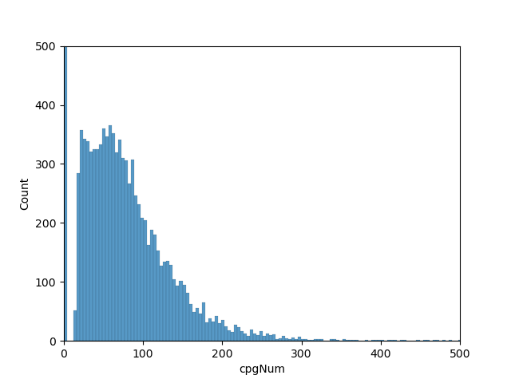

# CpGislandInTranscriptionSite
遺伝子の転写開始地点前後1,000bpにCpG islandが含まれているかを、UCSCgenomeBrowserより取得したデータを元に解析した。
  遺伝子の座標情報および、CpG islandの座標情報を取得し、それらを互いに参照することにより求められる。
  This analysis try to find how many genes have CpG islands in the parental genes
  the analysis is based on UCSC genome Browser

## どれくらいの遺伝子にCpGislandが含まれているか？ 
  -> 29,795の全遺伝子があるうち9,069の遺伝子にCpGが含まれる。他は転写開始地点+-1000bpの領域にCpGが含まれない。

## CpGislandが含まれている場合、一般にどれくらいの長さのCpGがあるのか？ -> 9,069の遺伝子を対象にヒストグラムで可視化する。
### Result Image

